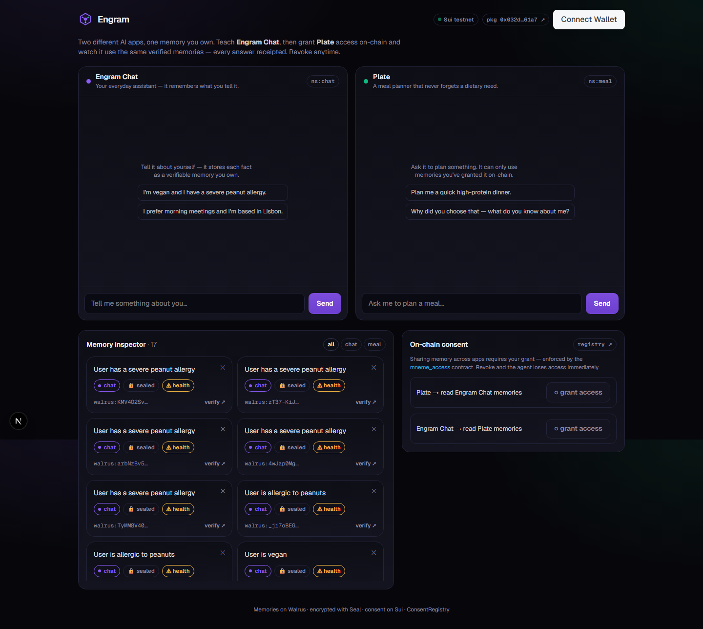

<div align="center">


# Engram

### Your AI's memory — owned by you, and provably honest.

A user-owned, verifiable **memory layer for AI agents**, built on **Sui · Walrus · Seal**.

[Live demo](#run-it-locally) · [The demo in 5 beats](#the-demo-in-5-beats) · [Architecture](#architecture) · [On-chain](#live-on-sui-testnet)

*Built for Sui Overflow 2026 — Agentic Web × Walrus.*

</div>

---

## The problem

Today your AI's memory of you is locked inside each app — ChatGPT, Claude, Gemini all keep their own private, invisible notes. You can't see them, move them, verify them, or audit *why* an agent said what it said. As agents start **acting** for us — booking, buying, advising — that becomes a trust and ownership crisis: *who owns your AI's memory, and can you trust what it remembers?*

## What Engram does

Engram turns AI memory into something **you own and control**, on three pillars:

1. **Ownership** — every fact an agent learns is stored as an encrypted memory on **Walrus** (via MemWal). You hold the keys. The memory is portable across apps.
2. **Verifiability & accountability** — every memory shows its **Walrus blob ID**; anyone can fetch it from the public network and confirm it's real and encrypted. Every agent answer is **receipted** — it cites the exact memories it used, so you can audit and correct it.
3. **Consent** — one app can only read another app's memories if **you grant it on-chain**. Grants/revokes are real Sui transactions that emit an audit trail. Revoke, and the agent loses access **immediately**.

Sensitive facts (health, finance, identity) are auto-classified and protected with **Seal** under an access policy **you** control.

## The demo in 5 beats



> Two different AI apps, one memory you own. (`/app`)

1. **Capture** — Tell **Engram Chat**: *"I'm vegan and I have a severe peanut allergy."* → it's extracted into discrete memories, each with a Walrus blob ID and a 🔒 sealed badge; the allergy is flagged **health-sensitive**.
2. **Inspect** — The memory inspector shows each memory's owner (your Sui address), Walrus storage link, and sensitivity. Click **verify** → it's fetched live from the public Walrus aggregator.
3. **Port + consent** — Open **Plate** (a meal-planner — a *different* app/namespace). Ask it to plan dinner. It's **blocked** — no consent. **Grant** it access on-chain (one click → a Sui tx). Now it plans a safe, vegan, peanut-free meal.
4. **Audit** — Every Plate answer shows **receipts**: the exact memories it used, each linking to its Walrus blob.
5. **Revoke** — Revoke Plate on-chain → it instantly can no longer read your chat memories. Verifiably enforced, not a UI toggle.

## Architecture

```
            ┌──────────────────────────── Browser (Next.js / React) ─────────────────────────┐
            │   Engram Chat (ns: chat)        Plate (ns: meal)        Inspector · Consent · Verify │
            └───────────────┬──────────────────────┬───────────────────────────┬───────────────┘
                            │  /api/capture,/agent  │  /api/grant,/grants       │ /api/verify
            ┌───────────────▼──────────────────────▼───────────────────────────▼───────────────┐
            │                         Next.js Route Handlers (server)                            │
            │   memory-service  ·  consent (reads/writes chain)  ·  agent (Azure OpenAI)         │
            └───────┬───────────────────────┬────────────────────────────┬─────────────────────┘
                    │ remember/analyze/recall│ grant/revoke/isAuthorized  │ GET blob
            ┌───────▼─────────┐     ┌────────▼──────────┐        ┌────────▼─────────┐
            │  MemWal relayer │     │  mneme_access     │        │  Walrus          │
            │  → Walrus+Seal  │     │  (our Move pkg)   │        │  aggregator      │
            │  encrypted mem  │     │  ConsentRegistry  │        │  verify blobs    │
            └─────────────────┘     └───────────────────┘        └──────────────────┘
                         Sui testnet ───────────────────────────────────────
```

| Layer | Tech |
|---|---|
| Frontend | Next.js 16 (App Router), React 19, Tailwind 4 |
| Memory | **MemWal** (`@mysten-incubation/memwal`) — verifiable, semantic, encrypted memory on Walrus |
| Storage | **Walrus** — decentralized blob storage; every memory independently verifiable |
| Privacy | **Seal** — encryption + threshold key servers (memories encrypted at rest) |
| Consent | **`mneme_access`** — our Sui **Move** package: `ConsentRegistry`, `grant_access`/`revoke_access`, `seal_approve`, audit events |
| Agents | **Azure OpenAI** via the Vercel AI SDK (`@ai-sdk/azure`) |
| Chain | **Sui** (`@mysten/sui` v2) |

## Live on Sui testnet

| Object | ID |
|---|---|
| `mneme_access` package (module `registry`) | [`0x032dbacb…61a7`](https://suiscan.xyz/testnet/object/0x032dbacbb8573145f3a46dcd4c15ddf4164521504c4507847e5b51d4258361a7) |
| ConsentRegistry (shared) | [`0xa2ee2220…be86`](https://suiscan.xyz/testnet/object/0xa2ee2220e03cf17fd28cabfd8f515ad969f48e0713e720e9ad3a012edec7be86) |
| MemWal account | [`0x989bc044…67b8`](https://suiscan.xyz/testnet/object/0x989bc0443bd471d9b1698710705f688bcab8a7fec3dbbf73f6a83fbdf24867b8) |

The Move package is in [`move/mneme_access`](./move/mneme_access/sources/registry.move).

## How it works under the hood

- **Capture** — `MemWal.analyzeAndWait()` extracts discrete facts from free text; each is embedded, **encrypted (Seal)**, and stored on **Walrus**, returning a blob ID. We classify sensitivity and index the metadata.
- **Consent-gated recall** — when an agent recalls memory from another app's namespace, the server first checks `isAuthorized(appAddress, namespace)` by reading the on-chain `ConsentRegistry`. No live grant → that namespace is skipped and reported as **blocked**.
- **Grant / revoke** — `/api/grant` submits a real Sui transaction calling `registry::grant_access` / `revoke_access`, emitting `AccessGranted` / `AccessRevoked` events (a tamper-evident audit trail).
- **Verify** — `/api/verify` fetches the blob from the public Walrus testnet aggregator; a 200 proves the memory is certified and live on decentralized storage.
- **Seal-gated decryption (proven)** — sensitive memories can be Seal-encrypted bound to our package; the Seal **key servers** release decryption keys only if they can run `mneme_access::seal_approve`, which aborts unless the requester holds a live grant in the (shared) `ConsentRegistry`. So **revoke on-chain → the key servers refuse → the memory is undecryptable** — enforced by the network, not our server. Reproduce it: `node scripts/dev/seal-proof.mjs` (before grant → denied · after grant → decrypted · after revoke → denied). Module: [`src/lib/server/seal.ts`](./src/lib/server/seal.ts).

## Run it locally

```bash
pnpm install

# 1. provision a funded testnet key + a MemWal account, and run the
#    memory round-trip spike (writes .env.local):
node scripts/dev/bootstrap.mjs
#    (if the faucet is rate-limited, fund the printed address at faucet.sui.io and re-run)

# 2. add Azure OpenAI creds to .env.local for full AI replies (optional —
#    without them, agents return a fallback that still shows memory + consent):
#    AZURE_OPENAI_API_KEY=...  AZURE_OPENAI_RESOURCE_NAME=...  AZURE_OPENAI_DEPLOYMENT=gpt-4o

pnpm dev            # http://localhost:3000  (landing) · /app (the product)
```

The `mneme_access` package is already published to testnet; to redeploy your own:

```bash
cd move/mneme_access && sui client publish --gas-budget 100000000
# then set MNEME_PACKAGE_ID + create a ConsentRegistry (registry::create) → MNEME_REGISTRY_ID
```

`node scripts/dev/reset.mjs` returns to a clean demo slate (empty inspector, no grants).

## Project structure

```
move/mneme_access/        # Sui Move package: ConsentRegistry + seal_approve + events
src/app/                  # landing (/), dashboard (/app), API route handlers
src/lib/server/           # env, memwal, sui, walrus, consent, classify, agent, store, memory-service
src/components/           # Dashboard, AgentPanel, MemoryCard, ConsentPanel, Logo
scripts/dev/              # bootstrap (provision + spike), reset (clean slate)
```

## How this maps to judging

- **Real-world application (50%)** — data ownership + accountable AI is a genuine, timely problem as agents proliferate; the demo shows consent, audit, and portability with real stakes (a peanut allergy the agent must never forget).
- **Product & UX (20%)** — a polished dashboard: memory cards with verify, answer receipts, one-click on-chain grant/revoke.
- **Technical (20%)** — MemWal + Seal + Walrus + a custom Sui Move contract, *meaningfully* integrated and deployed to testnet, with everything independently verifiable on-chain and on Walrus.
- **Presentation & vision (10%)** — *the memory layer for the agentic web: you own your context, agents stay honest.*

## Wallet-native ownership

Connect a Sui wallet (via `@mysten/dapp-kit`) and **"adopt"** it to create your *own*
`ConsentRegistry` — after that, grant/revoke are **signed by your wallet** and the server gates recall
on your registry (the `registryId` flows through `/api/grants` and `/api/agent`). Until you connect, the
demo runs in frictionless server-custody mode. So ownership isn't a claim — the consent transactions are
literally yours. (Code: `src/components/owner.tsx`, `WalletBar.tsx`.)

## Roadmap

- zkLogin sign-in so memories are bound to the end-user's Sui account with no extension.
- Bind the MemWal memory account itself to the connected wallet (today the account is app-provisioned).
- A memory marketplace: license your verified memories to agents with revocable, on-chain terms.
- **Mainnet** deployment (architected as a config flip).

---

<div align="center">
Build boldly. Build meaningful things. Build on Sui.
</div>
